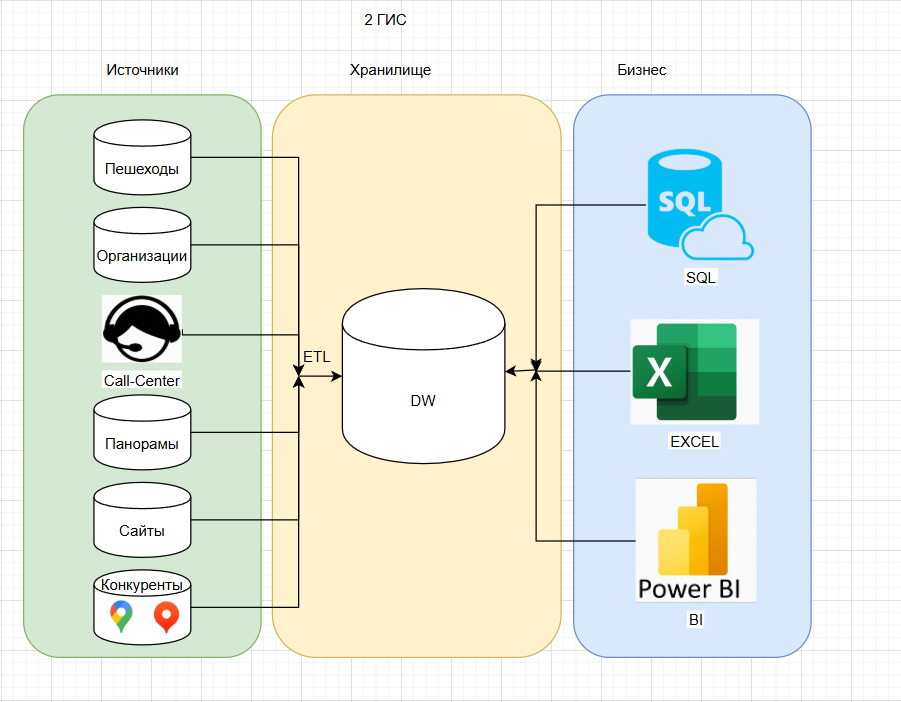
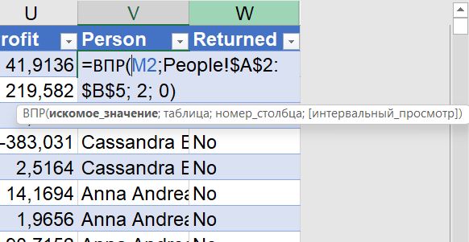
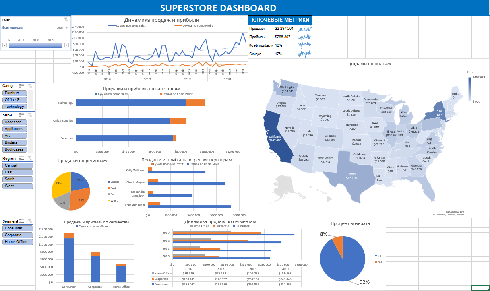
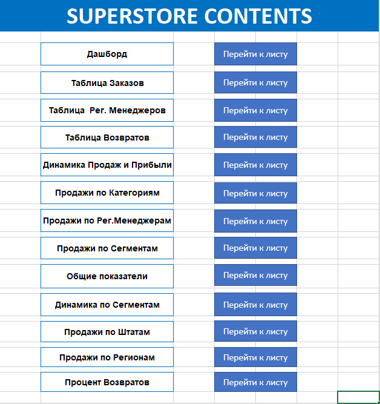

# Модуль 1 - Домашнее задание

## Архитектура решения

Для создания архитектуры решения я использовал draw.io. 
В качестве примера изобразил компанию "2ГИС" :

## Построение Dashboard

Для начала я соединил таблицы People и Returns с помощью функции ВПР(VLOOKUP):

Затем с помощью сводных(pivot) таблиц и диаграмм создал дашборд, добавил срезы и временную шкалу:

А также сделал содержание:

Результат:

[DashboardSuperstore.xlsx](%D0%97%D0%B0%D0%B4%D0%B0%D0%BD%D0%B8%D0%B5_2/DashboardSuperstore.xlsx)