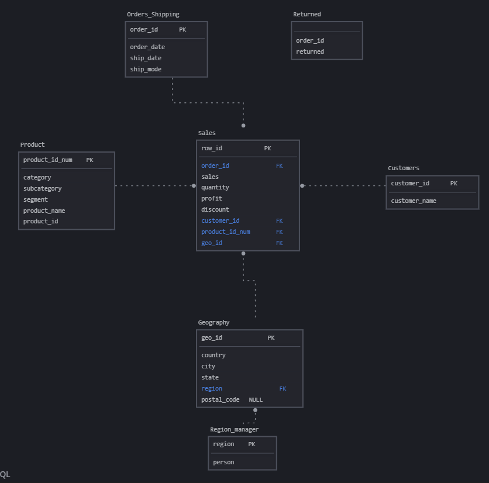
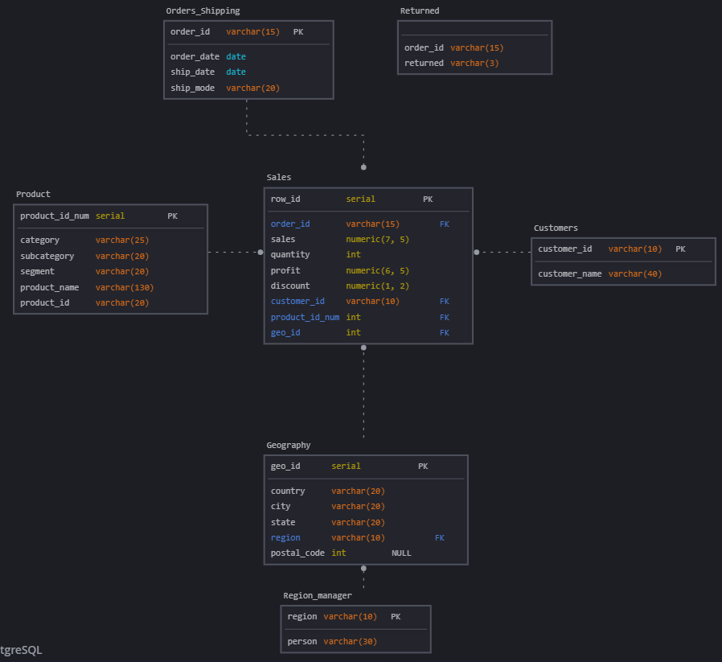

# Задание для модуля 2

## Загрузка данных в БД
Испольуя DBeaver я создал 3 таблицы orders, people, returns используя готовые скрипты из модуля 2.

Затем написал, запросы которые выводят:
1) Динамику общей суммы продаж и прибыли:
``` SQL 
select TO_CHAR(order_date, 'YYYY')    as year
	  ,TO_CHAR(order_date, 'MM')      as month
	  ,ROUND(SUM(sales)) || '$'	      as total_sales
	  ,ROUND(SUM(profit)) || '$' 	  as total_profit
from orders
group by year, month
order by year, month;
```
2) Динамику процента прибыли
``` SQL 
select TO_CHAR(order_date, 'YYYY')                  as year
	  ,TO_CHAR(order_date, 'MM')                    as month
	  ,ROUND(SUM(profit) / SUM(sales) * 100) || '%' as profit_ratio
from orders
group by year, month
order by year, month;
```

3) Процент прибыли с заказа
``` SQL 
select order_id,
	   ROUND(SUM(profit) / SUM(sales) * 100) || '%' as profit_ratio
from orders
group by order_id
order by order_id;
```

4) Суммы продаж каждого покупателя
``` SQL 
select customer_id, customer_name,
	   ROUND(SUM(sales)) || '$' as sales
from orders
group by customer_id, customer_name
order by customer_id;
```

5) Динамика средней скидки
``` SQL 
select TO_CHAR(order_date, 'YYYY')                  as year
	  ,TO_CHAR(order_date, 'MM')                    as month
	  ,ROUND(AVG(discount) * 100) || '%'            as avg_discount
from orders
group by year, month
order by year, month;
```

6) Динамика продаж по сегментам
``` SQL 
select TO_CHAR(order_date, 'YYYY')                  as year
	  ,TO_CHAR(order_date, 'MM')                    as month
	  ,                                                segment
	  ,ROUND(SUM(sales)) || '$'                     as sales
from orders
group by year, month, segment
order by year, month, segment;
```

7) Динамика продаж по категориям
``` SQL 
select TO_CHAR(order_date, 'YYYY')                  as year
	  ,TO_CHAR(order_date, 'MM')                    as month
	  ,                                                category 
	  ,ROUND(SUM(sales)) || '$'                     as sales
from orders
group by year, month, category
order by year, month, category;
```
## Модель данных

Я решил сделать модель данных 3NF (По Инману):.
Использовать буду сервис sqldbm. На ней отсутствует режим просмотра логической модели но я думаю 

Концептуальная модель:


Логическая модель:



Физическая модель:



Затем я сделал скрипт, который создаёт таблицы и заполняет их:

``` SQL

-- ************************************** Customers
drop table if exists Customers cascade;
create table Customers
(
 customer_id   varchar(10) primary key not null,
 customer_name varchar(40)             not null
);


-- ************************************** Region_manager
drop table if exists Region_manager cascade;
create table Region_manager
(
 region varchar(10) primary key not null,
 person varchar(30) 			not null
);


-- ************************************** Geography
drop table if exists Geography cascade;
create table Geography
(
 geo_id      serial      primary key not null,
 country     varchar(20) 			 not null,
 city        varchar(20) 			 not null,
 "state"     varchar(20) 			 not null,
 region      varchar(10) 			 not null,
 postal_code int                     null,
 constraint FK_6 foreign key ( region ) references Region_manager ( region )
);


-- ************************************** Orders_Shipping
drop table if exists Orders_Shipping cascade;
create table Orders_Shipping
(
 order_id   varchar(15) primary key not null,
 order_date date 					not null,
 ship_date  date 					not null,
 ship_mode  varchar(20) 			not null
);


-- ************************************** Product
drop table if exists Product cascade;
create table Product
(
 product_id_num serial       primary key  not null,
 product_id     varchar(20)               not null,
 category       varchar(25)  			  not null,
 subcategory    varchar(20)  			  not null,
 segment        varchar(20)  			  not null,
 product_name   varchar(130) 			  not null
);


-- ************************************** Returned
drop table if exists Returned cascade;
create table Returned
(
 order_id varchar(15) unique  not null,
 returned varchar(3)          not null
);


-- ************************************** Sales
drop table if exists Sales cascade;
create table Sales
(
 row_id      	 serial        primary key 	not null,
 order_id    	 varchar(15) 			   	not null,
 sales       	 numeric(12, 5) 			not null,
 quantity    	 int 					   	not null,
 profit      	 numeric(11, 5) 			not null,
 discount    	 numeric(3, 2) 			   	not null,
 geo_id      	 int 				   	    not null,
 product_id_num  int			   		   	not null,
 customer_id     varchar(10) 			   	not null,
 constraint FK_2 foreign key ( geo_id ) references Geography ( geo_id ),
 constraint FK_5 foreign key ( product_id_num ) references Product ( product_id_num ),
 constraint FK_6_1 foreign key ( customer_id ) references Customers ( customer_id ),
 constraint FK_7_1 foreign key ( order_id ) references Orders_Shipping ( order_id )
);


--- Заполнение Customers
insert into Customers
select distinct customer_id, customer_name
from orders;


--- Заполнение Region_manager
insert into Region_manager
select distinct region, person 
from people;


--- Заполнение Geography
ALTER SEQUENCE Geography_geo_id_seq RESTART WITH 101;
insert into Geography (country, city, "state", region, postal_code)
select distinct country, city, "state", region, postal_code
from orders;


--- Заполнение Orders_Shipping
insert into Orders_Shipping
select distinct order_id, order_date, ship_date, ship_mode
from orders;


--- Заполнение Product
ALTER SEQUENCE Product_product_id_num_seq RESTART WITH 101;
insert into Product(product_id, category, subcategory, segment, product_name)
select distinct product_id, category, subcategory, segment, product_name
from orders;


--- Заполнение Returned
insert into Returned
select distinct order_id, returned
from returns;


--- Заполнение Sales

insert into Sales(order_id, sales, quantity, profit, discount, geo_id, product_id_num, customer_id)
select order_id, sales, quantity, profit, discount, geo_id, product_id_num, customer_id
from orders o 
join geography g on (o.country, o.city, o."state", o.region, o.postal_code) IS NOT DISTINCT FROM 
					(g.country, g.city, g."state", g.region, g.postal_code) 
join product p on  (o.product_id, o.category, o.subcategory, o.segment, o.product_name) = 
				   (p.product_id, p.category, p.subcategory, p.segment, p.product_name);
```

Также прилагаю его в виде готового скрипта:
[Physical_Model.sql](%D0%97%D0%B0%D0%B4%D0%B0%D0%BD%D0%B8%D0%B5%202/Physical_Model.sql)